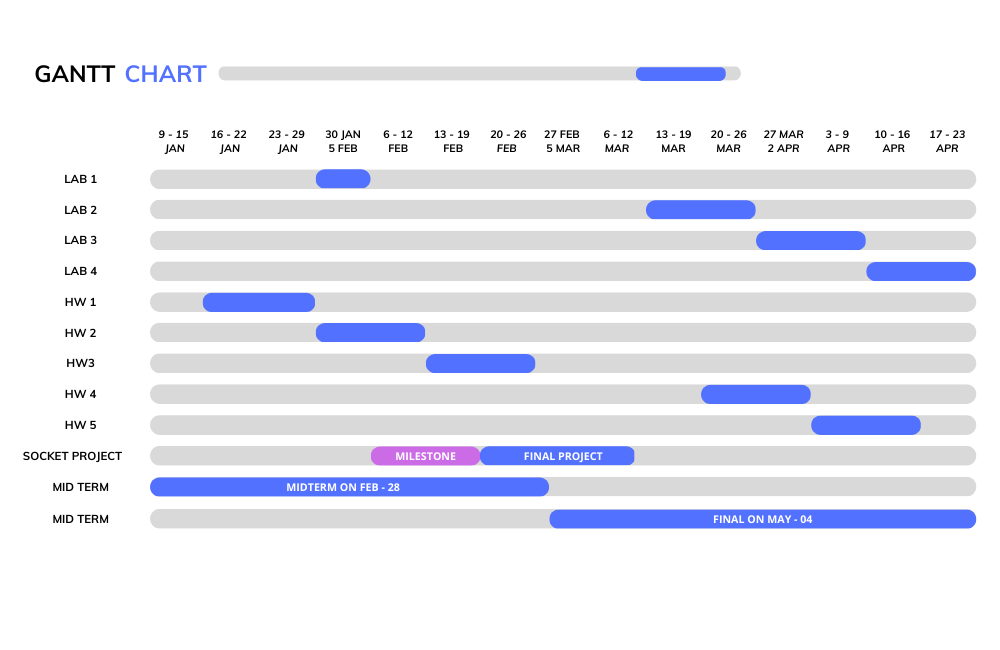

# CSE 434

<h2>CSE 434 Gannt chart</h2>
 
 
## Modules 
[Week One](https://github.com/berrios96sean/CSE-434/tree/main/Week_One)

## All Lecture Notes 
* [Lecture One](https://github.com/berrios96sean/CSE-434/blob/main/Week_One/1_1_Notes.txt) 
* [Lecture Two](https://github.com/berrios96sean/CSE-434/blob/main/Week_One/1_2_Notes.txt) 
* [Lecture Three](https://github.com/berrios96sean/CSE-434/blob/main/Week_Two/2_1_Notes.txt) 
* [Lecture Four]() 
* [Lecture Five]() 
* [Lecture Six]() 
